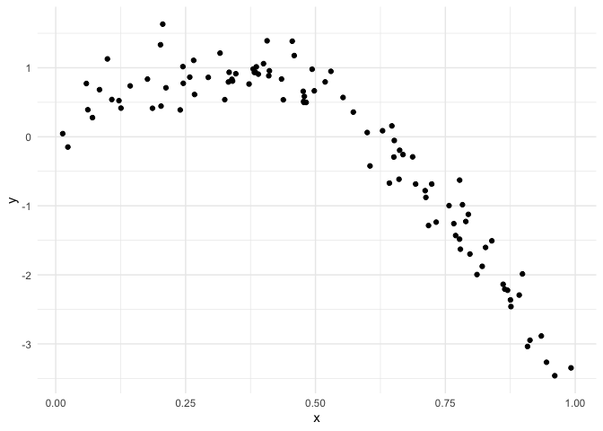
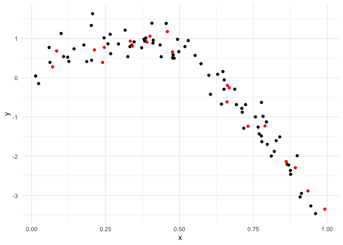
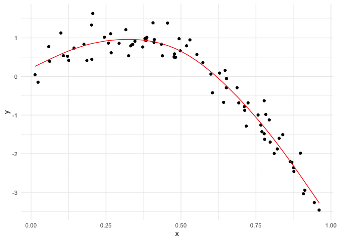
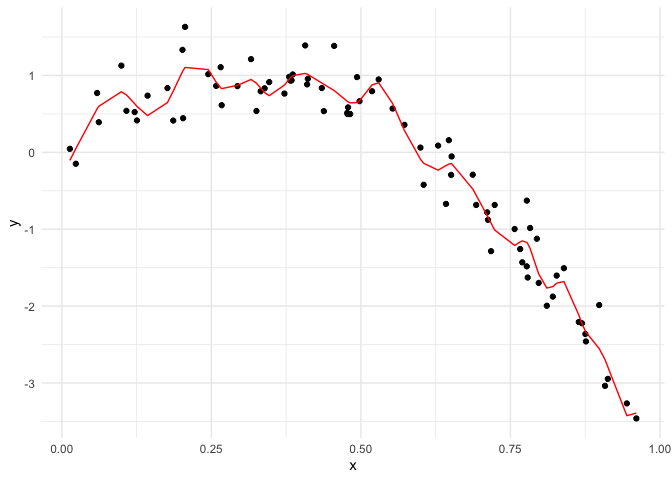
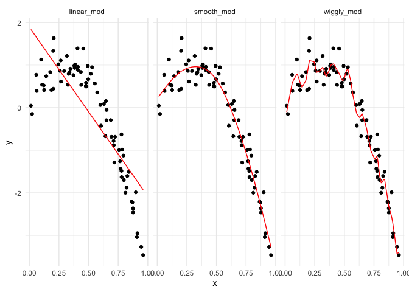

Cross Validation
================

``` r
library(tidyverse)
```

    ## ── Attaching core tidyverse packages ──────────────────────── tidyverse 2.0.0 ──
    ## ✔ dplyr     1.1.3     ✔ readr     2.1.4
    ## ✔ forcats   1.0.0     ✔ stringr   1.5.0
    ## ✔ ggplot2   3.4.3     ✔ tibble    3.2.1
    ## ✔ lubridate 1.9.2     ✔ tidyr     1.3.0
    ## ✔ purrr     1.0.2     
    ## ── Conflicts ────────────────────────────────────────── tidyverse_conflicts() ──
    ## ✖ dplyr::filter() masks stats::filter()
    ## ✖ dplyr::lag()    masks stats::lag()
    ## ℹ Use the conflicted package (<http://conflicted.r-lib.org/>) to force all conflicts to become errors

``` r
library(modelr)
library(mgcv)
```

    ## Loading required package: nlme
    ## 
    ## Attaching package: 'nlme'
    ## 
    ## The following object is masked from 'package:dplyr':
    ## 
    ##     collapse
    ## 
    ## This is mgcv 1.8-42. For overview type 'help("mgcv-package")'.

``` r
theme_set(theme_minimal() + theme(legend.position = "bottom"))

options(
  ggplot2.continuous.colour = "viridis",
  ggplot2.continuous.fill = "viridis"
)

scale_colour_discrete = scale_colour_viridis_d
scale_fill_discrete = scale_fill_viridis_d

set.seed(1)
```

## Nonlinear data and CV

``` r
nonlin_df = 
  tibble(
    id = 1:100,
    x = runif(100, 0, 1),
    y = 1 - 10 * (x - .3) ^ 2 + rnorm(100, 0, .3)
  )

nonlin_df |> 
  ggplot(aes(x = x, y = y)) + 
  geom_point()
```

<!-- -->

Do the train / test split

``` r
train_df = sample_n(nonlin_df, 80)
test_df = anti_join(nonlin_df, train_df, by = "id")

ggplot(train_df, aes(x = x, y = y)) + 
  geom_point() + 
  geom_point(data = test_df, color = "red")
```

<!-- -->

``` r
linear_mod = lm(y ~ x, data = train_df)
smooth_mod = mgcv::gam(y ~ s(x), data = train_df)
wiggly_mod = mgcv::gam(y ~ s(x, k = 30), sp = 10e-6, data = train_df)
```

quick visualization of the linear model with smooth mod

``` r
train_df |> 
  add_predictions(smooth_mod) |> 
  ggplot(aes(x = x, y = y)) + geom_point() + 
  geom_line(aes(y = pred), color = "red")
```

<!-- -->

same visualization of the linear model with wiggly mod

``` r
train_df |> 
  add_predictions(wiggly_mod) |> 
  ggplot(aes(x = x, y = y)) + geom_point() + 
  geom_line(aes(y = pred), color = "red")
```

<!-- -->

comparing the linear models

``` r
train_df |> 
  gather_predictions(linear_mod, smooth_mod, wiggly_mod) |> 
  mutate(model = fct_inorder(model)) |> 
  ggplot(aes(x = x, y = y)) + 
  geom_point() + 
  geom_line(aes(y = pred), color = "red") + 
  facet_wrap(~model)
```

<!-- -->

compute root mean squared errors (RMSEs) for each model

``` r
rmse(linear_mod, train_df)
```

    ## [1] 0.7178747

``` r
rmse(smooth_mod, train_df)
```

    ## [1] 0.2874834

``` r
rmse(wiggly_mod, train_df)
```

    ## [1] 0.2498309

``` r
rmse(linear_mod, test_df)
```

    ## [1] 0.7052956

``` r
rmse(smooth_mod, test_df)
```

    ## [1] 0.2221774

``` r
rmse(wiggly_mod, test_df)
```

    ## [1] 0.289051

RMSEs on training data is misleading. While RMSEs on testing data gives
a sesne of out-of-sample predicition accuracy.
